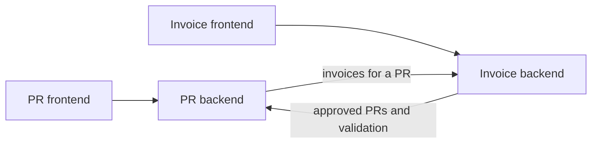

# Integration Design

## Problem interpretation

The Purchase Request (PR) and Invoice applications support two stages of the
same purchasing process, but they do not exchange business data. An employee
creates a purchase request in the PR application and finance reviews it. When a
supplier invoice arrives, finance registers it in a separate application and
manually copies the PR number and supplier details from emails and documents.

The systems do not verify this relationship. An invoice can refer to a missing
or unapproved request, or contain a different supplier. A user looking at a PR
cannot see its invoices or payment status, so finance has to reconcile the two
systems in spreadsheets.

The prototype will remove this manual copying and make the relationship visible
in both workflows. It will keep the applications and their data ownership
separate rather than combine them into one service.

## Current constraints

The following are facts observed in the existing repository:

- The PR backend uses FastAPI and SQLAlchemy. The Invoice backend uses Spring
  Boot and JPA.
- Both applications currently use the same PostgreSQL database, but they do not
  integrate through their domain models. Sharing a database is not treated as
  an integration contract.
- Schema ownership is unclear: the PR application creates tables through
  SQLAlchemy, while the Invoice application uses Hibernate `ddl-auto: update`.
- The Invoice application stores `purchase_request_number` and `supplier` as
  free text. It does not check that the PR exists or is approved.
- Each application has its own session and cookie. Logging in to one does not
  authenticate a user in the other.
- A PR has no requested amount, so the system cannot compare requested,
  invoiced, and paid amounts.
- Automated test coverage is sparse, and there is no CI configuration.

The prototype makes these assumptions:

- A PR code is unique and does not change after creation.
- Only an approved PR can have an invoice.
- An approved PR cannot be edited or moved back to an earlier state in the
  current workflow.
- One PR can have multiple invoices, for example a prepayment invoice and a
  final invoice.
- It is acceptable to stop invoice creation briefly when the PR application is
  unavailable. Higher availability is discussed in the roadmap.

---

## Proposed design

The applications will communicate through synchronous backend-to-backend HTTP
requests. Neither backend will read the other application's tables directly.



In the Invoice application, finance will select an approved PR from a list
instead of typing its code and supplier manually. The Invoice backend will get
the list from the PR backend. On form submission, it will validate the selected
PR again before saving the invoice. The second check is required because client
input is not trusted and the earlier list may be stale.

In the PR application, the PR details view will include a separate list of
linked invoices. The PR backend will request that list from the Invoice backend
when it is needed. Invoice data will not be copied into the PR database.

The two existing frontends will remain separate in the prototype. A unified
interface and single sign-on are product improvements rather than requirements
for the core integration.

## Domain model and ownership

The PR application remains the source of truth for:

- PR code, name, author, and description;
- supplier name and email on the request;
- approval status and allowed approval transitions.

The Invoice application remains the source of truth for:

- invoice number and attachment;
- invoice total and amount paid;
- invoice payment status;
- the relationship from an invoice to a PR.

An invoice will store the validated PR code and a snapshot of the supplier name
returned by the PR application. The snapshot records the supplier known when
the invoice was registered. It will not be updated silently if the PR changes.
The current workflow already prevents edits after approval; a future correction
workflow would need explicit permissions and an audit trail.

The relationship is one-to-many: every invoice refers to one approved PR, while
a PR can have any number of invoices. The prototype will not enforce a single
invoice per PR.

## Integration contracts and state flow

All integration endpoints will require an `X-Integration-Key` header. The key
will come from an `INTEGRATION_API_KEY` environment variable shared by the two
backends. It will never be sent to either frontend or included in a Vite
environment variable.

### PR integration endpoints

`GET /integration/purchase-requests/invoice-options`

Returns only approved PRs for the Invoice application selection list. Each item
contains:

```json
{
  "request_code": "PR-1",
  "request_name": "First test request",
  "supplier_name": "Acme Ltd"
}
```

`GET /integration/purchase-requests/{request_code}/invoice-context`

Validates one PR immediately before invoice creation. A successful response
contains the confirmed PR code and supplier snapshot:

```json
{
  "request_code": "PR-1",
  "supplier_name": "Acme Ltd"
}
```

The endpoint returns `404 Not Found` when the PR does not exist and `409
Conflict` when it exists but is not approved.

### Invoice integration endpoint

`GET /integration/invoices?purchase_request_number=PR-1`

Returns invoice summaries for a PR:

```json
[
  {
    "id": 12,
    "invoice_number": "INV-2026-0512",
    "invoice_sum": 1000.00,
    "invoice_sum_paid": 0.00,
    "invoice_status": "created"
  }
]
```

The normal user-facing Invoice API will accept the selected PR code, invoice
fields, and optional attachment. It will not trust a supplier value from the
client. The supplier stored on the invoice will come from the successful PR
validation response.

The PR frontend will request linked invoices through its own backend. This will
be a separate request from loading the PR itself, allowing the main PR details
to remain available when the Invoice application is down.

## Failure and ambiguity handling

Invoice creation uses a fail-closed policy. If the PR backend cannot confirm
that a request exists and is approved, no invoice is saved.

- Missing PR: return `404` with a specific user-facing message.
- Existing but unapproved PR: return `409` with a specific message.
- Network error, timeout, or exhausted retry: return `503 Service Unavailable`.
- Invoice backend unavailable while viewing a PR: keep the PR visible and show
  that invoice information is temporarily unavailable.

Calls will use an approximately one-second connection timeout and a two-second
response timeout. Read-only integration requests may be retried once for a
network error, timeout, or `502`, `503`, or `504` response. They will not be
retried for `404` or `409`, because those responses describe a valid business
result. Only `GET` requests are retried, so the retry cannot create duplicate
records.

The approved-PR list is a user-interface aid, not an authorization or
validation boundary. The Invoice backend always performs the single-PR check
again during creation.

The prototype allows multiple invoices for the same PR. It does not attempt to
identify duplicate supplier invoices because the required uniqueness rule is
not specified. Invoice-number uniqueness may be scoped by supplier in a future
version after confirming the business rule.

## Testing and validation

The planned automated tests focus on failures that could create an invalid
cross-service relationship:

- an invoice cannot be created for a missing PR;
- an invoice cannot be created for an unapproved PR;
- the supplier returned by the PR backend is stored instead of an untrusted
  client value;
- an upstream timeout or error does not save an invoice;
- multiple invoices can be linked to one PR;
- integration endpoints reject a missing or incorrect service key;
- failure to load invoices does not prevent the PR itself from being viewed.

HTTP dependencies will be stubbed in backend tests so that success, business
errors, timeouts, and temporary upstream errors are deterministic. A manual
Docker Compose scenario will verify the complete user flow:

1. Create and approve a PR.
2. Select it in the Invoice application and confirm that the supplier is filled
   automatically.
3. Register two invoices for the PR.
4. Open the PR and confirm that both invoices are visible.
5. Stop one backend and verify the relevant error or degraded view.

This section will be updated with the actual test commands and results after
the prototype is implemented.

## Trade-offs and alternatives

### Synchronous HTTP

Synchronous HTTP keeps the prototype small and provides current PR data at the
moment an invoice is created. Its main cost is a runtime dependency: Invoice
creation is temporarily unavailable when the PR backend is unavailable. This
is acceptable for the prototype because correctness is more important than
accepting an invoice that cannot be validated.

### Direct access through the shared database

The Invoice backend could query the PR tables or use a foreign key because both
applications currently share PostgreSQL. This would require less HTTP code, but
it would couple both services to the same schema and bypass PR business rules.
It was rejected because the database layout is an implementation detail rather
than a stable service contract.

### Asynchronous events

Publishing PR approval events would let the Invoice application validate
against a local projection when the PR backend is unavailable. A reliable
version requires a message broker, transactional outbox, idempotent consumer,
retries, dead-letter handling, and a way to rebuild or backfill the projection.
That is useful when independent availability becomes a confirmed requirement,
but it adds more complexity than the current prototype needs.

## Prototype scope

The prototype will include:

- backend-to-backend authentication with a shared integration key;
- listing approved PRs in the Invoice workflow;
- server-side validation before invoice creation;
- automatic supplier transfer from PR to Invoice;
- a one-to-many relationship between a PR and its invoices;
- invoice summaries in the PR details workflow;
- focused automated tests and a documented demonstration scenario.

The prototype intentionally leaves out:

- a unified frontend and single sign-on;
- requested amount and amount-delta checks;
- supplier master data;
- duplicate-invoice detection;
- notifications and audit history;
- ERP and Purchase Order integration;
- asynchronous messaging and local projections.

The repository will continue to run through `docker compose up --build`. Exact
review steps and test commands will be added after implementation.

## Roadmap

### Near-term hardening

1. Replace automatic schema creation with explicit, versioned migrations and
   make table ownership clear for each service.
2. Add CI for backend tests and contract checks.
3. Add structured integration logs, request correlation IDs, latency/error
   metrics, and alerts for repeated upstream failures.
4. Define invoice uniqueness and idempotency rules with finance, then enforce
   them in the API and database.
5. Replace the static integration key with OAuth2 Client Credentials using
   short-lived tokens and secret rotation.

### Higher availability through events

If invoice registration must continue while the PR backend is unavailable, the
PR application can publish versioned `purchase_request.approved` events through
RabbitMQ. The approval change and an outbox record should be written in the
same database transaction. A separate publisher sends unsent outbox records,
and the Invoice application consumes them into a local approved-PR projection.
Consumers must be idempotent by event ID, and failed messages need retry and
dead-letter handling. Existing approved PRs also need a backfill or replay
mechanism. Redis is not required for this flow.

### Broader product capabilities

1. Add a requested amount to the PR domain and show requested, invoiced, paid,
   and remaining amounts without treating them as the same value.
2. Introduce supplier master data with bank details, tax identifiers, and
   payment terms.
3. Add a unified navigation experience and single sign-on while retaining
   backend service boundaries.
4. Add correction workflows, notifications, and an audit trail.
5. Integrate Purchase Orders from the future ERP and report differences between
   requested, ordered, invoiced, and paid amounts.
