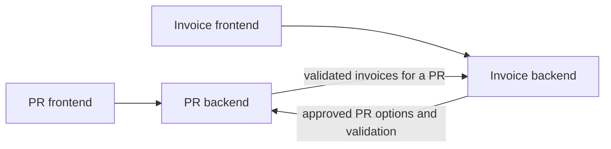

# Integration Design

## Problem interpretation

The Purchase Request (PR) and Invoice applications support different stages of
the same purchasing process, but initially they did not exchange business data.
After a PR was approved, finance manually copied its code and supplier into the
Invoice App when registering a supplier invoice. The Invoice App did not verify
that the PR existed, that it was approved, or that the supplier matched.

A user viewing a PR could not see its related Invoices or payment status.
Finance therefore reconciled the two applications manually through documents,
email, and spreadsheets. The prototype's goal was to create a verifiable
relationship between a PR and its Invoices while preserving the applications
as separate services with distinct responsibilities.

## Current constraints

The following describes the repository at the start of the integration work:

- the PR backend used FastAPI and SQLAlchemy, while the Invoice backend used
  Spring Boot and JPA;
- both applications used one PostgreSQL instance, but a shared database was not
  itself a business integration contract;
- schema ownership was insufficiently strict: SQLAlchemy created the PR App
  tables and Hibernate used `ddl-auto: update`;
- user sessions were independent between the applications;
- `purchase_request_number` and supplier in the Invoice App were free-text
  fields;
- PRs had no structured requested amount or currency; adding them was a
  possible product extension, not an established requirement for the
  prototype;
- automated tests were sparse and CI was absent;
- the integration was required to avoid additional coupling through direct
queries to the neighbouring application's tables.

## Implemented prototype

The Purchase Request (PR) and Invoice applications remain separate services
and exchange business data through synchronous backend-to-backend HTTP calls.
Neither service queries the other service's tables, even though the prototype
still runs both applications on one PostgreSQL instance.



The integration supports two user flows:

- finance selects and validates an approved PR while creating an Invoice;
- a user viewing a PR can see all Invoices linked through a validated
  relationship.

The frontends call only their own backends. Integration credentials and
cross-service calls remain on the server side.

## Ownership and data representation

The PR App is the source of truth for the PR code, request details, approval
status, and supplier recorded on the request. The Invoice App owns Invoice
data, attachments, payment status, and the relationship from an Invoice to a
PR.

When that relationship is validated, the Invoice App stores:

- the confirmed PR code in `purchase_request_number`;
- the supplier returned by the PR App as a snapshot;
- the validation time in `purchase_request_validated_at`.

The snapshot records what the PR App returned when the link was confirmed. It
is not updated automatically and can therefore differ from the current PR
supplier later. One PR can have multiple Invoices.

Invoice totals received by the PR backend are validated as Python `Decimal`
values. They are serialized to JSON numbers to match the Java contract. The
current model has no currency field, so neither the contract nor the PR
frontend adds a currency symbol.

## Creating an Invoice

The implemented creation flow is:

1. When the Invoice form opens, the Invoice frontend calls
   `GET /invoice/purchase-request-options` on the Invoice backend using the
   user's Invoice App session.
2. The Invoice backend calls
   `GET /integration/purchase-requests/invoice-options` on the PR backend.
   This internal endpoint returns only approved PRs.
3. The user selects an option displayed by PR code and request name. The
   supplier is populated from that option and is read-only in the form.
4. On submission, the Invoice backend does not trust the submitted supplier.
   It calls
   `GET /integration/purchase-requests/{request_code}/invoice-context` to
   validate the selected PR again.
5. Only after successful validation does the Invoice backend save the
   confirmed code, supplier snapshot, and `purchase_request_validated_at`.

The second lookup prevents a stale options list from authorizing a missing or
no-longer-approved request. Validation happens before the repository save. If
validation fails, no Invoice is persisted. The same rules protect changing an
existing Invoice to a different PR; keeping an already validated unchanged
relationship does not trigger an unnecessary lookup.

## Displaying Invoices in the PR App

The PR frontend loads Invoice information as a separate section of the PR
details modal:

1. It calls `GET /purchase-request/{request_code}/invoices` on the PR backend
   with the normal PR App user session.
2. The PR backend first checks that the PR exists, then calls
   `GET /integration/invoices?purchase_request_number=PR-1` on the Invoice
   backend.
3. The Invoice backend returns only rows whose
   `purchase_request_number` matches and whose
   `purchase_request_validated_at` is not null.

This filter deliberately excludes legacy free-text relationships: an old
matching string is not presented as a confirmed integration link. The PR App
does not store a copy of Invoice or payment data.

The frontend section has independent loading, empty, list, and error states.
It cancels obsolete requests and guards against late responses when the modal
closes or another PR is selected. An Invoice integration failure affects only
this section; the PR data and its existing actions remain available.

## Authentication and configuration

The applications use two directional integration keys:

- `PR_INTEGRATION_API_KEY` protects the internal PR endpoints called by the
  Invoice backend;
- `INVOICE_INTEGRATION_API_KEY` protects the internal Invoice endpoint called
  by the PR backend.

The PR backend locates the Invoice backend through `INVOICE_APP_URL`. The
Invoice backend uses `PR_API_BASE_URL` for the PR backend. Each internal call
sends the appropriate key in `X-Integration-Key`.

These keys are used only between backends. They are not exposed through Vite
configuration, frontend responses, or browser requests, and an integration key
does not authorize a user-facing endpoint. User access continues to use the
applications' separate opaque-cookie sessions (`pr_token` and
`invoice_token`). Logging in to one application does not create a session in
the other.

Development key defaults exist only in `docker-compose.yml` to keep local
startup simple. Production code has no fallback integration credentials and
fails closed when a required key is absent. A production deployment should
inject distinct values from a normal secret-management system and support
controlled rotation rather than use the Compose defaults.

## Failure handling

Both integration clients use a one-second connect timeout and a two-second
read/response timeout. A request has at most two attempts: the initial call and
one immediate retry without backoff. Retries are limited to timeouts, network
errors, and HTTP `502`, `503`, or `504`. Business responses and invalid
contracts are not retried.

The user-facing outcomes are:

- a missing PR returns `404` during Invoice validation;
- a PR that is not approved returns `409`;
- an unavailable or unconfigured upstream dependency returns `503`;
- a malformed or otherwise invalid upstream response returns `502`.

Controlled error messages do not include integration keys, upstream response
bodies, backend URLs, exception causes, or stack traces.

The two flows intentionally use different availability policies. Invoice
creation is fail-closed because persisting an unverified relationship would
corrupt business data. PR viewing uses graceful degradation because Invoice
information is supplementary: the PR remains visible when the Invoice App is
unavailable.

## Synchronous client in the PR App

The PR App already uses synchronous SQLAlchemy `Session` objects. Its Invoice
summary endpoint is therefore a normal synchronous FastAPI path operation
(`def`) and uses the blocking `httpx.Client`. FastAPI executes synchronous path
operations in a thread pool, so this HTTP call does not block the main event
loop. This keeps the implementation consistent with the existing data-access
style and is adequate for a small prototype.

This does not make blocking I/O unbounded or indefinitely scalable: a slow
upstream call still occupies a worker thread until it completes or times out.
If concurrency requirements grow, the coherent change is to adopt
`httpx.AsyncClient` together with SQLAlchemy `AsyncSession`. Converting only
the HTTP client would introduce a mixed execution model without meaningful
benefit at the current scale.

## Testing and CI

The implemented automated checks are:

- 37 PR backend pytest tests;
- 69 Invoice backend Maven/JUnit tests;
- production builds for both React frontends.

The backend integration tests use dependency overrides, mocks,
`httpx.MockTransport`, Spring `MockRestServiceServer`, SQLite, and H2. They do
not require PostgreSQL or a running neighbouring service.

The tests cover the main integration risks:

- only approved PRs are offered for Invoice selection;
- the selected PR is checked again before an Invoice is saved;
- a submitted supplier cannot replace the validated supplier;
- validation failure does not save or partially mutate an Invoice;
- multiple validated Invoices can link to one PR;
- internal endpoints reject missing, incorrect, or unconfigured keys;
- legacy relationships without `purchase_request_validated_at` are excluded;
- an Invoice outage does not break the main PR list or details;
- malformed upstream JSON and contract violations are rejected;
- retries happen only for the allowed network and status failures.

GitHub Actions defines four independent jobs for the PR backend, Invoice
backend, PR frontend, and Invoice frontend. It runs for pull requests and
pushes to `master`, and through manual dispatch. The jobs use locked dependency
installation where lock files exist and do not start Docker Compose or external
services. No coverage percentage is claimed because coverage is not measured.

The complete user flow and degraded PR view have also been checked manually
with Docker Compose.

## Development approach and AI assistance

The architecture, scope, integration contracts, and acceptance criteria were defined and reviewed by the candidate. The Python integration code and its tests were written manually by the candidate, with AI used as a discussion and code-review aid.

An AI coding agent was used primarily to assist with the Java and React parts, which are outside the candidate's primary Python backend stack. These changes were introduced through narrowly scoped tasks and were reviewed through diffs, automated tests, production builds, and manual end-to-end checks before acceptance. The CI workflow was also inspected, corrected, and verified by the candidate after it was introduced.

AI assistance did not replace validation of the result: architectural decisions, integration behaviour, failure scenarios, final review, and responsibility for the submitted solution remained with the candidate.

## Running and demonstrating the prototype

Start the complete local environment from the repository root:

```bash
docker compose up --build
```

The PR App is available at `http://localhost:5173` and the Invoice App at
`http://localhost:5174`.

A concise demonstration is:

1. Sign in to the PR App as an employee and create a PR.
2. Send the PR for approval.
3. Sign in as a finance user and approve it.
4. Open the Invoice App with a finance session.
5. Select the approved PR and verify that its supplier is filled
   automatically.
6. Create two Invoices for that PR.
7. Return to the PR App and open the PR details.
8. Confirm that both Invoices and their payment states are shown.
9. Stop the Invoice backend and reopen the PR.
10. Confirm that the PR remains usable while its Invoice section reports that
    Invoice information is temporarily unavailable.

## Trade-offs and intentional omissions

Synchronous HTTP was chosen for a small and understandable prototype. It keeps
data current at validation time, but each cross-service feature depends on the
neighbouring service being available. The single immediate retry handles a
brief transient failure but has no backoff or jitter.

The shared PostgreSQL deployment was retained, while application integration
still goes through HTTP rather than foreign tables. Schema ownership remains
insufficiently strict: the PR App creates its schema through SQLAlchemy and the
Invoice App uses Hibernate `ddl-auto: update`.
`purchase_request_validated_at` was added without a full migration tool. These
choices are acceptable for the prototype but not a safe production migration
strategy.

Other intentional limitations are:

- the supplier is a point-in-time snapshot and is not reconciled later;
- user sessions are independent between applications;
- frontend tests were not added because the repository had no frontend test
  infrastructure;
- there is no distributed tracing, metrics, correlation ID propagation, or
  circuit breaker;
- there is no requested amount, currency, supplier master data, duplicate
  Invoice rule, Purchase Order model, ERP integration, notification, or audit
  history;
- there is no unified user interface or single sign-on.

## Roadmap

### Near-term production hardening

1. Introduce Alembic and Flyway, or otherwise establish explicit migration and
   schema ownership for each service.
2. Move both directional keys to a secret manager with rotation, then replace
   static shared keys with OAuth2 Client Credentials or mTLS where warranted.
3. Add structured logs, metrics, traces, and correlation IDs across service
   calls.
4. Add retry backoff and jitter, a circuit breaker, and operational alerts.
5. Add contract/OpenAPI tests and frontend test infrastructure.
6. Resolve dependency audit findings and existing deprecation warnings.
7. Enforce expiry, rotation, and revocation for user session tokens and use
   production cookie settings.
8. Measure thread-pool limits and service behaviour under load before choosing
   an async migration.

### Architectural evolution

If real availability, scale, or audit requirements justify it, synchronous
lookups can evolve to events through RabbitMQ or another broker. A reliable
design would need a transactional outbox, idempotent consumers, a local Invoice
read projection in the PR App, explicit eventual-consistency rules, and a
reconciliation process. These mechanisms should answer measured requirements,
not be added only to introduce more technology.

### Product capabilities

1. Add a structured requested amount and currency to PRs, then implement
   requested/invoiced/paid reconciliation and show remaining amounts.
2. Add Purchase Orders, supplier master data, and ERP integration.
3. Add a unified interface and shared user authentication.
4. Improve search and make PRs with similar or identical names easier to
   distinguish.

The PR code is already the unique identifier used by the integration. Making
`request_name` unique, or enforcing a naming policy, would be a separate
product and UX decision rather than an established requirement.
